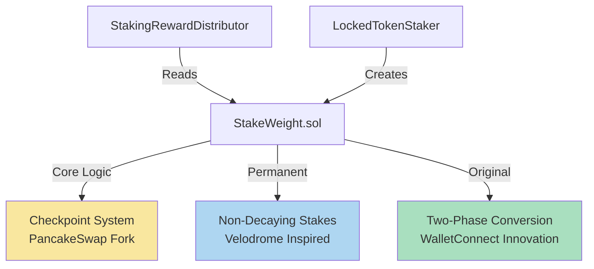

# P3 Staking Redesign – Audit Scope & Security Requirements

## Document Purpose

This document defines the security requirements, threat models, and testing priorities for auditing the P3 staking
redesign. It complements the three essential technical documents that address specific auditor requests:
1. **[CODE_EVOLUTION.md](CODE_EVOLUTION.md)** – Code provenance ("What's forked vs original?")
2. **[MATH_AND_DESIGN.md](MATH_AND_DESIGN.md)** – Mathematical formulas ("Math this is based on")
3. **[SECURITY_CONSIDERATIONS.md](SECURITY_CONSIDERATIONS.md)** – Upgrade safety mechanisms

## Executive Summary

The P3 redesign adapts Velodrome's permanent staking innovation to WalletConnect's production ve-style system. This
"open heart surgery" on live contracts managing millions in user funds required careful engineering to preserve
existing positions while introducing non-decaying staking. The implementation demonstrates sophisticated state
management through two-phase checkpoints and ERC-7201 storage patterns.

### Primary Security Concerns

1. **Early Withdrawal Prevention** – Mathematical guarantee: `lock.end > block.timestamp → no withdrawal`
2. **Reward System Integrity** – Conservation law: `Σ(user_claims) ≤ tokensPerWeek[week]`
3. **Checkpoint Consistency** – Two-phase atomic transitions prevent intermediate corrupt states
4. **Storage Layout Safety** – ERC-7201 namespacing prevents proxy upgrade corruption
5. **Stack Depth Management** – Single storage pointer pattern avoids "stack too deep" without --via-ir

### Critical Code Attribution

- **Core checkpoint system**: Forked from PancakeSwap/Curve
- **Permanent staking patterns**: Adapted from Velodrome
- **WalletConnect innovations**: Discrete durations, two-phase conversion, LockedTokenStaker integration

## System Architecture



### Mathematical Foundation

```solidity
// Decaying (from Curve/veCRV):
voting_power(t) = bias - slope × (t - timestamp)
bias = amount × (unlock_time - current_time) / MAX_LOCK
slope = amount / MAX_LOCK

// Permanent (from Velodrome):
permanent_weight = amount × duration_weeks / 104

// Global Supply (WalletConnect hybrid):
total_supply = Σ(decaying_biases) + Σ(permanent_weights)
```

## Critical Security Requirements

### 1. Early Withdrawal Prevention

**Mathematical Invariant**:
```solidity
∀ user: (lock.end > block.timestamp) → (withdrawal_blocked)
```

**Implementation** (StakeWeight.sol:732-745):
```solidity
if (locks[user].end > block.timestamp) {
    revert LockStillActive();
}
```

**Permanent Lock Protection** (StakeWeight.sol:748):
```solidity
if (isPermanent[user]) {
    revert NotUnlocked();
}
```

**Test Scenarios**:
```bash
forge test --mt test_earlyWithdrawalReverts -vvv
forge test --mt test_permanentWithdrawalRequiresUnlock -vvv
forge test --mt test_adminCanForceWithdraw -vvv
```

### 2. Two-Phase Checkpoint Atomicity

**Requirement**: State transitions MUST be atomic to prevent double-counting.

**Implementation** (StakeWeight.sol:890-898):
```solidity
// Phase 1: Zero out decaying position
_checkpoint(user, oldLock, LockedBalance(0, 0, 0));

// Phase 2: Create permanent position
_checkpoint(user, LockedBalance(0, 0, 0), permanentLock);
```

**Invariant**: Between phases, user has zero balance (no intermediate corrupt state)

**Critical Check**:
```solidity
assert(supply_before_phase1 - user_weight == supply_after_phase1);
assert(supply_after_phase2 == supply_after_phase1 + permanent_weight);
```

### 3. Reward Distribution Integrity

**Week Alignment** (all timestamps floor to week):
```solidity
timestamp = (timestamp / 1 weeks) * 1 weeks;
```

**Conservation Law**:
```solidity
Σ(user_claims_for_week) ≤ tokensPerWeek[week]
user_reward = (user_weight / total_weight) × weekly_tokens
```

### 4. Storage Layout Safety (ERC-7201)

**Namespaced Storage** (StakeWeight.sol:65-89):
```solidity
bytes32 constant STORAGE_LOCATION =
    keccak256("walletconnect.storage.StakeWeight");

struct StakeWeightStorage {
    // Original fields preserved (never modify)
    mapping(address => LockedBalance) locks;
    uint256 epoch;
    Point[1000000] pointHistory;

    // New fields appended (safe to add)
    mapping(address => bool) isPermanent;
    mapping(address => uint256) permanentStakeWeight;
    uint256 permanentTotalSupply;
}
```

**Upgrade Safety Checklist**:
```bash
# Compare storage layouts
forge inspect StakeWeight storage-layout > new.json
forge inspect OldStakeWeight storage-layout > old.json
diff old.json new.json  # Should only show additions
```

### 5. Stack Depth Management

**Problem**: Without --via-ir, complex functions hit "stack too deep"

**Solution Pattern**:
```solidity
function complexOperation() external {
    // Single storage pointer for all access
    StakeWeightStorage storage $ = _getStakeWeightStorage();

    // Use $ throughout function
    $.locks[user] = newLock;
    $.epoch += 1;
    $.permanentSupply += amount;
}
```

**Engineering Constraints**:
- Max function parameters: 6-7 before stack issues
- Max local variables: 12-14 in complex functions
- Solution: Extract helper functions, use storage pointer

## Loop Iteration Limits

### StakeWeight Checkpoint (Max 255 iterations)
```solidity
for (uint256 i = 0; i < 255; i++) {  // ~5 years
    if (weekCursor > block.timestamp) break;
    // Process week...
}
```

### StakingRewardDistributor (Max 52 iterations)
```solidity
for (uint256 i = 0; i < 52; i++) {  // ~1 year
    if (weekCursor > block.timestamp) break;
    // Distribute rewards...
}
```

**Known Limitation**: System breaks if no checkpoint for >255 weeks (5 years)
**Mitigation**: Regular checkpoint calls (can be done by any user)

## Critical System Invariants

```solidity
// I1: Supply Conservation
invariant totalSupply == Σ(locks[user].amount)
    where !isPermanent[user] || permanentUnlockTime[user] == 0

// I2: Permanent Weight Consistency
invariant permanentTotalSupply == Σ(permanentStakeWeight[user])
    where isPermanent[user]

// I3: Time Monotonicity
invariant ∀ i: pointHistory[i].timestamp <= pointHistory[i+1].timestamp

// I4: No Negative Bias
invariant ∀ point: point.bias >= 0 after decay calculation
```

## Testing Strategy

### Concrete Test Coverage
```solidity
// test/StakeWeight.t.sol
- State transitions: 42 tests
- Edge cases: 18 tests
- Admin operations: 8 tests
- Integration: 15 tests
```

### Fuzz Testing
```bash
forge test --mc StakeWeightInvariant \
  --fuzz-runs 100000 \
  --fuzz-seed 0x1234
```

### Fork Testing
```bash
export OPTIMISM_RPC_URL=https://optimism-rpc.publicnode.com
forge test --mc Fork --fork-url $OPTIMISM_RPC_URL
```

## Priority Attack Vectors

### 1. Storage Collision on Upgrade
**Vector**: Reordering fields corrupts mappings
**Mitigation**: ERC-7201 namespace isolation
**Test**: `forge test --mt test_upgradePreservesStorage`

### 2. Double-Counting in Conversion
**Vector**: Non-atomic phase transition
**Mitigation**: Two-phase checkpoint
**Test**: `forge test --mt test_conversionAtomicity`

### 3. Checkpoint Gap DoS
**Vector**: 255+ week gap breaks system
**Mitigation**: Automated checkpoints
**Test**: `forge test --mt test_maxIterations`

### 4. Integer Overflow in Bias
**Vector**: int128 overflow with large amounts
**Mitigation**: SafeCast, amount limits
**Test**: `forge test --mt test_biasOverflow`

## Key Test Scenarios

### Permanent Lock Lifecycle
```solidity
function test_permanentLockFullCycle() {
    // Create permanent lock
    stakeWeight.createPermanentLock(1e24, 52);
    assertEq(stakeWeight.permanentStakeWeight(user), 1e24 * 52 / 104);

    // Trigger unlock
    stakeWeight.triggerUnlock();
    assertTrue(!stakeWeight.isPermanent(user));

    // Wait and withdraw
    vm.warp(block.timestamp + 52 weeks);
    stakeWeight.withdrawAll();
    assertEq(token.balanceOf(user), 1e24);
}
```

### Two-Phase Conversion Safety
```solidity
function test_conversionMaintainsSupply() {
    uint256 supplyBefore = stakeWeight.totalSupply();

    stakeWeight.convertToPermanent(52);

    uint256 supplyAfter = stakeWeight.totalSupply();
    assertEq(supplyBefore, supplyAfter, "Supply mismatch");
}
```

### Storage Upgrade Safety
```solidity
function test_upgradePreservesPositions() {
    // Snapshot before
    uint256 aliceBalance = stakeWeight.balanceOf(alice);
    bool alicePermanent = stakeWeight.isPermanent(alice);

    // Upgrade proxy
    proxy.upgradeTo(newImplementation);

    // Verify preservation
    assertEq(stakeWeight.balanceOf(alice), aliceBalance);
    assertEq(stakeWeight.isPermanent(alice), alicePermanent);
}
```

## Gas Profiling Results

```
Function               | Avg Gas  | Max Iterations
--------------------- |----------|---------------
createLock            | 180,000  | 1 checkpoint
convertToPermanent    | 220,000  | 2 checkpoints
claim (1 week)        | 45,000   | 1 iteration
claim (52 weeks)      | 850,000  | 52 iterations
_checkpoint (1 week)  | 65,000   | 1 iteration
_checkpoint (52 weeks)| 1,200,000| 52 iterations
```

## Production Deployment Checklist

### Pre-Deployment
- [ ] Run full test suite: `forge test --force`
- [ ] Compare storage layouts: `forge inspect`
- [ ] Simulate upgrade on fork
- [ ] Review with 2+ engineers

### Deployment
- [ ] Deploy new implementation
- [ ] Upgrade proxy via multisig
- [ ] Run verification script
- [ ] Monitor first 24 hours

### Post-Deployment
- [ ] Verify all user positions intact
- [ ] Test claim functionality
- [ ] Check permanent conversions
- [ ] Monitor gas usage

## Recommended Audit Focus

### Week 1: Core Mechanics
- Storage layout safety (ERC-7201)
- Two-phase checkpoint atomicity
- Mathematical correctness (bias/slope)
- Loop iteration bounds

### Week 2: Integration
- StakingRewardDistributor interaction
- LockedTokenStaker vesting flow
- Cross-contract reentrancy
- Admin operation safety

### Week 3: Edge Cases
- Time boundary conditions
- Integer overflow scenarios
- Gas optimization opportunities
- Upgrade simulation

## Accepted Risks & Mitigations

| Risk | Impact | Likelihood | Mitigation |
|------|--------|------------|------------|
| 255 week checkpoint gap | System failure | Extremely Low | Regular checkpoint calls |
| Stack depth without --via-ir | Compilation failure | Resolved | Single storage pointer |
| Integer precision loss | Minor reward variance | Low | High precision (1e18) |
| Discrete duration set | UX limitation | Accepted | Clear UI guidance |
| Admin key compromise | Fund recovery | Low | Multisig + timelock |

## Contract Reference

### StakeWeight.sol (1073 lines)
- **Lines 400-720**: Checkpoint system (PancakeSwap/Curve patterns)
- **Lines 860-1060**: Permanent staking logic (Velodrome-inspired)
- **Lines 1-399, 721-859**: WalletConnect-specific implementations

### Key Code Sections
- **Two-phase checkpoint**: Lines 890-898
- **Storage layout**: Lines 65-106
- **Permanent conversion**: Lines 860-903
- **Force withdraw**: Lines 775-815

### Critical Functions
```solidity
_checkpoint(address, LockedBalance, LockedBalance) // Two-phase safety
convertToPermanent(uint256) // Velodrome-inspired
forceWithdrawAll(address) // Admin recovery
_getStakeWeightStorage() // Stack depth management
```

## Essential Testing Commands

```bash
# Comprehensive test suite (required before deployment)
forge test --mc StakeWeight --no-match-contract Fork -vvv

# High-confidence fuzzing (100k runs minimum)
forge test --mc StakeWeightInvariant --fuzz-runs 100000

# Fork testing with production state
source .optimism.env && export OPTIMISM_RPC_URL=https://optimism-rpc.publicnode.com
forge test --mc Fork --fork-url $OPTIMISM_RPC_URL --force

# Storage layout comparison (critical for upgrades)
forge inspect StakeWeight storage-layout > new.json
forge inspect OldStakeWeight storage-layout > old.json
diff old.json new.json  # Must show only additions
```

## Summary

The P3 staking redesign represents sophisticated engineering that successfully adapted Velodrome's permanent staking
to WalletConnect's production system. Through careful use of:

1. **Two-phase atomic checkpoints** - Preventing state corruption
2. **ERC-7201 storage patterns** - Ensuring upgrade safety
3. **Stack depth management** - Working within Solidity constraints
4. **Mathematical precision** - Maintaining accurate voting power

The implementation achieves "open heart surgery" on a live system while preserving all existing user positions and
maintaining system integrity. The three companion documents provide complete technical analysis:

- **CODE_EVOLUTION.md** - Traces code provenance and attribution
- **MATH_AND_DESIGN.md** - Documents mathematical foundations with implementations
- **SECURITY_CONSIDERATIONS.md** - Details critical safety mechanisms

---

_This audit scope document complements the three essential technical documents that directly address auditor requests
for mathematical formulas and code attribution. Together, they provide comprehensive coverage for security review._
