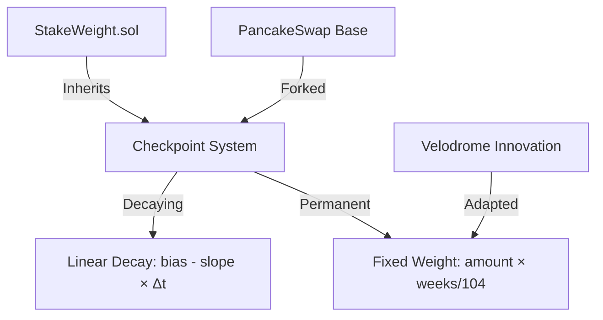
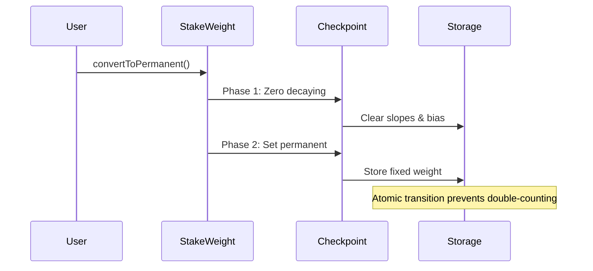

# P3 Staking Redesign – Audit Documentation Summary

## Executive Summary

The P3 redesign introduces permanent (non-decaying) staking to WalletConnect's vote-escrowed token system. This upgrade was performed as "open heart surgery" on a live production system managing millions in user funds, adapting Velodrome's permanent staking innovations while maintaining backward compatibility.

## Essential Audit Documents

### 1. [CODE_EVOLUTION.md](CODE_EVOLUTION.md) – Code Provenance Analysis
**Addresses Auditor Request #2: "What code is ours vs what's forked?"**
- Traces evolution: Curve veCRV → PancakeSwap VECake → Velodrome → WalletConnect
- Line-by-line attribution showing forked vs original code
- Credits Velodrome for permanent staking concept
- Documents WalletConnect's specific adaptations

### 2. [MATH_AND_DESIGN.md](MATH_AND_DESIGN.md) – Mathematical Formulas
**Addresses Auditor Request #1: "Math formulas this is based off"**
- Core checkpoint mathematics: `voting_power(t) = bias - slope × (t - timestamp)`
- Permanent weight calculations with exact code references
- Global supply aggregation formulas
- Week-aligned timestamp optimizations

### 3. [SECURITY_CONSIDERATIONS.md](SECURITY_CONSIDERATIONS.md) – Upgrade Safety
**Critical for Production Deployment**
- ERC-7201 namespaced storage pattern for safe upgrades
- Stack depth management without --via-ir optimizer
- Two-phase checkpoint mechanism for atomic state transitions
- Invariant preservation strategies

## Critical Implementation Details

### Checkpoint System Architecture



### Two-Phase Checkpoint Safety



## Key Engineering Constraints

### Stack Depth Management
Without --via-ir optimizer, the implementation uses single storage pointer pattern:
```solidity
StakeWeightStorage storage $ = _getStakeWeightStorage();
// All storage access through $ to avoid stack depth errors
```

### ERC-7201 Namespaced Storage
```solidity
bytes32 constant STORAGE_LOCATION = keccak256("walletconnect.storage.StakeWeight");
// Prevents storage collision during upgrades
```

## Critical Invariants

1. **Supply Conservation**: `totalSupply == Σ(user_amounts) at any checkpoint`
2. **No Early Withdrawal**: `lock.end > block.timestamp → no withdrawal`
3. **Checkpoint Consistency**: `∀ epoch: history[epoch].timestamp ≤ history[epoch+1].timestamp`
4. **Permanent Immutability**: `isPermanent[user] → cannot revert to decaying`

## Testing Commands

```bash
# Run comprehensive test suite
forge test --mc StakeWeight --no-match-contract Fork -vvv

# Run invariant tests with high fuzzing
forge test --mc StakeWeightInvariant --fuzz-runs 100000

# Fork testing with production data
source .optimism.env
export OPTIMISM_RPC_URL=https://optimism-rpc.publicnode.com
forge test --mc StakeWeightFork --fork-url $OPTIMISM_RPC_URL --force
```

## Summary

The P3 redesign successfully adapts Velodrome's permanent staking to WalletConnect's production system through:
- Careful preservation of existing storage layout
- Two-phase atomic checkpoint transitions
- Stack depth management without --via-ir
- Comprehensive testing across all state transitions

The three essential documents above provide auditors with:
1. **CODE_EVOLUTION.md**: Clear attribution of forked vs original code
2. **MATH_AND_DESIGN.md**: Mathematical foundations with implementation
3. **SECURITY_CONSIDERATIONS.md**: Critical safety mechanisms for production