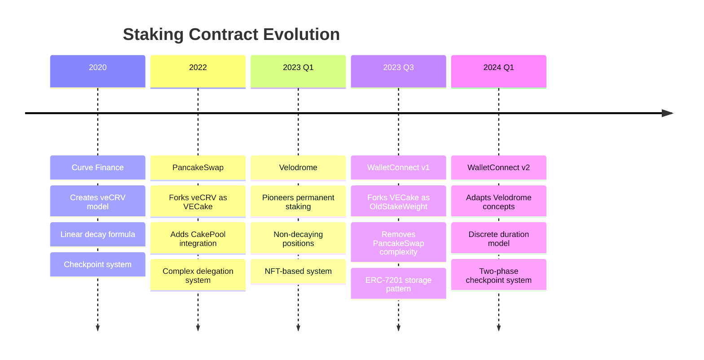

# Code Evolution & Provenance Analysis

## Executive Summary

This document traces the evolution of WalletConnect's staking contracts from their PancakeSwap origins through two major iterations, documenting what was forked, what was modified, and what was innovated. The development represents "open heart surgery" on a live production system, with each decision carefully made to maintain upgrade safety while adding novel functionality.

## Evolution Timeline



## Part A: First Iteration - PancakeSwap Fork to WalletConnect v1

### 1. VECake.sol → OldStakeWeight.sol

#### Origins
- **Source**: PancakeSwap's VECake.sol (itself derived from Curve's veCRV)
- **Core Mechanism**: Vote-escrowed tokens with linear decay over time

#### Major Removals
```solidity
// REMOVED: PancakeSwap-specific features
- ICakePool integration
- ProxyForCakePool system
- Delegator mechanism
- Migration functions (migrateFromCakePool, delegateFromCakePool)
- Early withdrawal with penalties
- Emergency withdraw
- FarmBooster integration
- Circuit breaker system
```

#### Retained Core Mechanics
```solidity
// KEPT: Essential ve-token mathematics
+ Linear decay formula: bias - slope × time
+ Checkpoint mechanism for gas efficiency
+ Binary search for historical queries
+ Week-aligned timestamps
+ 209-week maximum lock (later reduced to 105 weeks)
```

#### WalletConnect Additions
```solidity
// ADDED: Clean architecture patterns
+ ERC-7201 namespaced storage (upgrade safety)
+ WalletConnectConfig integration
+ Simplified access control (removed whitelisting)
+ LockedTokenStaker role for vesting contracts
+ Transfer restrictions integration with L2WCT
```

#### Key Structural Changes
```solidity
// PancakeSwap approach (monolithic)
contract VECake {
    mapping(address => LockedBalance) public locks;
    mapping(address => UserInfo) public userInfo;  // CakePool data
    mapping(address => Delegator) public delegator; // Complex delegation
    // ... 600+ lines of mixed concerns
}

// WalletConnect v1 approach (focused)
contract OldStakeWeight {
    struct StakeWeightStorage {  // ERC-7201 pattern
        WalletConnectConfig config;
        uint256 supply;
        mapping(address => LockedBalance) locks;
        // ... only staking-related state
    }
}
```

### 2. RevenueSharingPool.sol → OldStakingRewardDistributor.sol

#### Major Removals
```solidity
// REMOVED: CakePool proxy complexity
- balanceOfAtProxy() and related proxy functions
- claimForUser() with proxy logic
- Complex recipient management for contracts
- canCheckpointToken public flag
- whitelistedCheckpointCallers
```

#### Simplifications
```solidity
// SIMPLIFIED: Cleaner claim logic
- Single claim path (no proxy branching)
- Direct recipient management
- Removed "GrassHouse" naming remnants
- Cleaner initialization pattern
```

#### Retained Distribution Logic
```solidity
// KEPT: Weekly distribution mechanics
+ 52-week iteration limits
+ Proportional token distribution
+ Binary search for epochs
+ Week-aligned reward calculations
```

## Part B: Second Iteration - Velodrome Integration & Permanent Staking

### 3. OldStakeWeight.sol → StakeWeight.sol (Velodrome-Inspired Adaptation)

#### Velodrome's Permanent Staking Model
Velodrome pioneered the concept of permanent (non-decaying) locks in their VotingEscrow:
- **Permanent state**: Positions that maintain constant voting power
- **isPermanent flag**: Boolean marker for non-decaying positions
- **end = 0**: Using zero end time to denote permanent status
- **lockPermanent/unlockPermanent**: Functions to convert between states

#### Why Direct Copying Was Impossible
Velodrome's architecture fundamentally differs:
```solidity
// Velodrome: Separate contracts with delegation
contract VotingEscrow {
    // NFT-based with delegation
    mapping(uint256 => LockedBalance) locked;
    mapping(uint256 => address) delegation;
}

// WalletConnect: Single upgradeable contract
contract StakeWeight {
    // Address-based, no NFTs
    // Stack depth limitations without --via-ir
    // Must preserve storage layout
}
```

#### WalletConnect's Adaptations of Velodrome Concepts

**Adapted Permanent Weight Calculation**
```solidity
// Velodrome: Simple permanent amount storage
UserPoint(0, 0, ts, permanent_amount)

// WalletConnect: Duration-multiplied weight system
permanentWeight = amount * duration / MAX_LOCK_CAP
// Added discrete durations for institutional needs
```

**The Two-Phase Checkpoint (WalletConnect Innovation)**
```solidity
// Required because we couldn't modify Velodrome's approach directly
// Maintains checkpoint history integrity
function convertToPermanent(uint256 duration) {
    // Phase 1: Zero out decaying position
    _checkpoint(user, lock, zeroLock);

    // Phase 2: Restore as permanent (end = 0)
    _checkpoint(user, zeroLock, permanentLock);
}
```

**Storage Architecture Constraints**
```solidity
struct StakeWeightStorage {
    // ===== EXISTING FIELDS (PRESERVED) =====
    WalletConnectConfig config;        // slot 0
    uint256 supply;                    // slot 1
    uint256 maxLock;                   // slot 2
    mapping(...) locks;                // slot 3
    uint256 epoch;                     // slot 4
    Point[] pointHistory;              // slot 5
    mapping(...) userPointHistory;     // slot 6
    mapping(...) userPointEpoch;       // slot 7
    mapping(...) slopeChanges;         // slot 8

    // ===== NEW FIELDS (APPENDED) =====
    // Stack depth prevented complex nesting
    mapping(address => bool) isPermanent;           // slot 9
    mapping(address => uint256) permanentBaseWeeks; // slot 10
    mapping(address => uint256) permanentStakeWeight; // slot 11
    uint256 permanentTotalSupply;                   // slot 12
    // Parallel history tracking
    mapping(uint256 => uint256) globalPermanentSupplyAtEpoch;
    mapping(address => mapping(uint256 => uint256)) userPermanentWeightAtEpoch;
}
```

#### Why Not Direct Velodrome Architecture?

**Velodrome's Approach**:
```solidity
// Velodrome uses separate contracts/libraries
contract VotingEscrow { ... }
library BalanceLogicLibrary { ... }
contract RewardsDistributor { ... }
```

**WalletConnect's Constraint**:
```solidity
// Single upgradeable contract requirement
// Stack depth issues without --via-ir
// Solution: Inline optimizations, careful scoping
contract StakeWeight {
    // All logic in one contract
    // Manual stack management
    // Strategic use of memory vs storage
}
```

### 4. OldStakingRewardDistributor.sol → StakingRewardDistributor.sol

#### Critical Innovation: Hybrid Reward System
```solidity
// Old: Simple cached supply
function _claim() {
    toDistribute = (balanceOf * tokensPerWeek) / totalSupplyAt[week];
}

// New: Dynamic calculation for mid-week conversions
function _claim() {
    // Calculate on-the-fly for accuracy
    uint256 balanceOf = this.balanceOfAt(user, weekCursor);
    uint256 totalSupply = _calculateTotalSupplyAt(weekCursor);

    // Handles permanent + decaying correctly
    toDistribute = (balanceOf * tokensPerWeek) / totalSupply;
}
```

#### Support for Permanent Positions
```solidity
// Added permanent-aware balance calculation
function balanceOfAt(address user, uint256 timestamp) {
    uint256 perm = stakeWeight.userPermanentAt(user, epoch);
    if (perm > 0) return perm;  // No decay

    // Otherwise calculate with decay
    int128 bias = point.bias - point.slope * timeDelta;
    return bias < 0 ? 0 : uint256(bias);
}
```

## Part C: Engineering Decisions & Constraints

### Stack Depth Management

**Problem**: "Stack too deep" errors without --via-ir
```solidity
// Would fail without --via-ir
function complexOperation() {
    uint256 var1, var2, var3, var4, var5, var6, var7, var8;
    uint256 var9, var10, var11, var12, var13, var14, var15, var16;
    // Error: Stack too deep
}
```

**Solutions Applied**:
1. Strategic use of storage pointers
2. Function splitting
3. Inline assembly for storage access
4. Careful variable scoping

### Storage Layout Preservation

**Critical Requirement**: Never break existing storage
```solidity
// NEVER DO THIS (would corrupt storage):
struct BadStorage {
    uint256 newField;        // DON'T insert before existing
    WalletConnectConfig config; // Would shift everything
}

// ALWAYS DO THIS:
struct GoodStorage {
    // ... existing fields unchanged ...
    uint256 newField;        // Only append at end
}
```

### "Open Heart Surgery" Considerations

1. **No Downtime**: Upgrades must be atomic
2. **State Preservation**: All user positions maintained
3. **Backward Compatibility**: Existing locks continue working
4. **Gas Efficiency**: Keep operations under block gas limit
5. **Verification**: Extensive testing before deployment

## Code Attribution Summary

### Inherited from PancakeSwap/Curve
- Basic veCRV mathematics
- Checkpoint mechanism
- Binary search algorithms
- Week alignment concept

### Inspired by Velodrome
- Optimization patterns
- Epoch handling improvements
- Distribution efficiency techniques
- Balance calculation strategies

### WalletConnect Original Contributions
- Permanent staking mechanism
- Two-phase checkpoint system
- Discrete duration model (4,8,12,26,52,78,104 weeks)
- Hybrid supply calculations
- Storage architecture design
- Integration patterns
- Dynamic APY model

## Conclusion

The evolution from PancakeSwap's VECake to WalletConnect's StakeWeight represents a careful, methodical transformation. Each iteration addressed specific limitations while maintaining production safety. The permanent staking innovation, while inspired by various ve-token implementations, is a novel solution to the problem of maintaining consistent voting power without requiring periodic user interactions.

The codebase demonstrates how forked code can be transformed into something original through understanding constraints, applying learned patterns, and innovating where existing solutions don't fit.