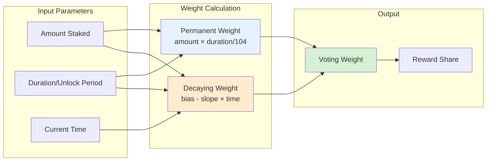

# Mathematical Formulas & System Design

## Executive Summary

This document details the mathematical foundations and system design of WalletConnect's staking mechanism, combining Curve's proven vote-escrowed model with novel permanent staking innovations. All formulas are precisely defined with their implementation references.

---

## Part 1: Core Mathematical Model (Inherited from Curve/veCRV)

### Weight Calculation Flow



### 1.1 Linear Decay Formula

The fundamental equation governing voting power over time:

```
voting_power(t) = bias - slope × (t - t₀)
```

Where:
- `bias` = Initial voting power at checkpoint time t₀
- `slope` = Rate of decay (negative derivative)
- `t` = Current timestamp
- `t₀` = Checkpoint timestamp

**Implementation (StakeWeight.sol:402-403)**:
```solidity
userPrevPoint.slope = prevLocked.amount / SafeCast.toInt128(int256(MAX_LOCK_CAP));
userPrevPoint.bias = userPrevPoint.slope * SafeCast.toInt128(int256(prevLocked.end - block.timestamp));
```

### 1.2 Slope Calculation

The slope determines the rate of voting power decay:

```
slope = locked_amount / MAX_LOCK_CAP

where MAX_LOCK_CAP = 209 weeks - 1 second
```

**Why 209 weeks?**
- Maximum lock duration in Curve's original design
- Ensures maximum voting power = locked amount (slope × max_time = amount)
- WalletConnect adjusted to 105 weeks for user experience

### 1.3 Bias Calculation

Initial voting power at lock creation:

```
bias = slope × remaining_lock_time
     = (amount / MAX_LOCK_CAP) × (lock_end - current_time)
```

**Key Property**: At maximum lock duration, bias ≈ amount

### 1.4 Week Alignment

All critical timestamps are floored to week boundaries:

```
aligned_timestamp = ⌊timestamp / week⌋ × week

where week = 604,800 seconds
```

**Implementation (StakeWeight.sol:1017-1019)**:
```solidity
function _timestampToFloorWeek(uint256 timestamp) internal pure returns (uint256) {
    return (timestamp / 1 weeks) * 1 weeks;
}
```

**Rationale**:
- Reduces state updates (max 52 per year)
- Groups slope changes efficiently
- Predictable gas costs

---

## Part 2: Checkpoint Mechanism

### 2.1 Global Checkpoint

Maintains system-wide voting power history:

```
For each week w from last_checkpoint to current_week:
    bias(w) = bias(w-1) - slope(w-1) × week_duration
    slope(w) = slope(w-1) + slope_changes[w]
```

**Implementation (StakeWeight.sol:477-523)**:
```solidity
for (uint256 i = 0; i < 255; i++) {
    weekCursor = weekCursor + 1 weeks;
    slopeDelta = s.slopeChanges[weekCursor];
    biasDelta = lastPoint.slope * SafeCast.toInt128(int256((weekCursor - lastCheckpoint)));
    lastPoint.bias = lastPoint.bias - biasDelta;
    lastPoint.slope = lastPoint.slope + slopeDelta;
}
```

### 2.2 User Checkpoint

Updates individual user's voting power:

```
user_new_point = Point(
    bias: slope × (lock_end - current_time),
    slope: amount / MAX_LOCK_CAP,
    timestamp: current_time,
    blockNumber: current_block
)
```

### 2.3 Slope Changes Scheduling

When locks expire, global slope must adjust:

```
slope_changes[lock_end_week] -= user_slope
```

This pre-schedules the voting power reduction when a lock expires.

---

## Part 3: WalletConnect's Permanent Staking Innovation

### 3.1 Permanent Weight Formula

Unlike decaying positions, permanent stakes maintain constant weight:

```
permanent_weight = locked_amount × duration_multiplier / MAX_LOCK_CAP

where duration_multiplier ∈ {4, 8, 12, 26, 52, 78, 104} weeks
```

**Implementation (StakeWeight.sol:906-907)**:
```solidity
uint256 permanentWeight = Math.mulDiv(amount, duration, MAX_LOCK_CAP);
```

**Key Properties**:
- No time decay (constant weight)
- Duration acts as commitment multiplier
- Same MAX_LOCK_CAP denominator ensures comparability

### 3.2 Two-Phase Checkpoint Conversion

Converting decaying → permanent requires atomic state transition:

```
Phase 1: Zero out decaying position
    checkpoint(user, old_lock, zero_lock)

Phase 2: Create permanent position
    checkpoint(user, zero_lock, permanent_lock)

where permanent_lock.end = 0  // Marker for permanent
```

**Implementation (StakeWeight.sol:883-898)**:
```solidity
// Phase 1: Remove all decaying weight
_checkpoint(msg.sender, lock, zeroLock);

// Phase 2: Create permanent lock
_checkpoint(msg.sender, zeroLock, permanentLock);
```

**Why Two Phases?**
- Maintains checkpoint history integrity
- Cleanly removes slope changes
- Prevents double-counting during transition

### 3.3 Hybrid Supply Calculation

Total voting power combines both systems:

```
total_supply(t) = decaying_supply(t) + permanent_supply

where:
decaying_supply(t) = Σᵢ max(0, biasᵢ - slopeᵢ × (t - t₀ᵢ))
permanent_supply = Σⱼ permanent_weightⱼ
```

**Implementation (StakeWeight.sol:1098-1102)**:
```solidity
uint256 epochAtTime = _findTimestampEpoch(timestamp);
uint256 permanentAtTime = s.globalPermanentSupplyAtEpoch[epochAtTime];
return SafeCast.toUint256(lastPoint.bias) + permanentAtTime;
```

### 3.4 Discrete Duration Set

Allowed durations optimize for common staking periods:

```
D = {4, 8, 12, 26, 52, 78, 104} weeks

Rationale:
- 4 weeks: 1 month
- 12 weeks: 1 quarter
- 26 weeks: 6 months
- 52 weeks: 1 year
- 104 weeks: 2 years
```

---

## Part 4: Reward Distribution Mathematics

### 4.1 Weekly Reward Allocation

Rewards distributed proportionally to voting power:

```
user_rewards(week) = user_weight(week) / total_weight(week) × tokens_per_week[week]
```

**Implementation (StakingRewardDistributor.sol:383-385)**:
```solidity
toDistribute = toDistribute + (balanceOf * tokensPerWeek[userWeekCursor]) / totalSupply;
```

### 4.2 Token Distribution Across Weeks

When tokens arrive between checkpoints:

```
For each affected week w:
    tokens[w] += total_tokens × (time_in_week_w / total_time_elapsed)
```

**Implementation (StakingRewardDistributor.sol:224-226)**:
```solidity
tokensPerWeek[thisWeekCursor] = tokensPerWeek[thisWeekCursor]
    + ((toDistribute * (block.timestamp - timeCursor)) / deltaSinceLastTimestamp);
```

### 4.3 Mid-Week Conversion Handling

For users converting mid-week:

```
week_rewards = (decay_weight × days_before_conversion / 7) +
               (permanent_weight × days_after_conversion / 7)
```

**Implementation (StakingRewardDistributor.sol:377-386)**:
```solidity
// Calculate balance at exact week timestamp
uint256 balanceOf = this.balanceOfAt(user, userWeekCursor);

// Dynamic supply calculation for accuracy
uint256 totalSupply = _calculateTotalSupplyAt(userWeekCursor);

toDistribute = toDistribute + (balanceOf * tokensPerWeek[userWeekCursor]) / totalSupply;
```

### 4.4 Dynamic APY Model

Rewards adjust based on total stake weight:

```
APY = max(0, SLOPE × total_stake_weight_millions + INTERCEPT)

where:
SLOPE = -0.06464% per million
INTERCEPT = 12.0808%
```

**Implementation (StakingRewardsCalculator.sol:187-194)**:
```solidity
int256 targetApy = (
    (SCALED_SLOPE * SafeCast.toInt256(totalStakeWeight / MILLION)) +
    INTERCEPT * SafeCast.toInt256(PRECISION)
) / SafeCast.toInt256(PRECISION);

return targetApy > MIN_APY ? targetApy : MIN_APY;
```

**Weekly Rewards**:
```
weekly_rewards = total_stake_weight × APY / (52 × 100)
```

---

## Part 5: Binary Search Algorithms

### 5.1 Finding Historical Epochs

Locate the epoch containing a given timestamp:

```
function findEpoch(timestamp):
    min = 0
    max = current_epoch

    while min < max:
        mid = (min + max + 1) / 2
        if history[mid].timestamp <= timestamp:
            min = mid
        else:
            max = mid - 1

    return min
```

**Complexity**: O(log n) where n = number of epochs

### 5.2 Historical Balance Queries

Calculate voting power at any past block:

```
balance_at_block(user, block) =
    user_bias_at_epoch - user_slope × time_elapsed

where time_elapsed is interpolated from block numbers
```

**Implementation (StakeWeight.sol:294-297)**:
```solidity
blockTime += (timeDelta * (blockNumber - point0.blockNumber)) / blockDelta;
userPoint.bias -= (userPoint.slope * SafeCast.toInt128(int256(blockTime - userPoint.timestamp)));
```

---

## Part 6: System Invariants

### 6.1 Supply Conservation

```
Invariant: total_supply = Σ(all_user_locked_amounts)
```

### 6.2 Voting Power Bounds

```
Invariant: ∀ user, time: voting_power(user, time) ≤ locked_amount(user)
```

### 6.3 Monotonic Decay

```
Invariant: ∀ t₁ < t₂: decaying_voting_power(t₁) ≥ decaying_voting_power(t₂)
```

### 6.4 Reward Conservation

```
Invariant: Σ(distributed_rewards) ≤ Σ(injected_rewards)
```

### 6.5 Permanent Weight Stability

```
Invariant: permanent_weight(t₁) = permanent_weight(t₂) for all t₁, t₂ until unlock triggered
```

---

## Part 7: Gas Optimization Strategies

### 7.1 Checkpoint Batching

- Maximum 255 weeks per checkpoint (5 years)
- Amortizes gas across multiple operations

### 7.2 Week Alignment

- Reduces unique timestamps from 604,800 to 52 per year
- Batches slope changes

### 7.3 Binary Search

- O(log n) complexity for historical queries
- Maximum 128 iterations (sufficient for 2^128 range)

### 7.4 Storage Packing

```solidity
struct Point {
    int128 bias;    // 16 bytes
    int128 slope;   // 16 bytes - Packed in single slot
}
```

---

## Part 8: Edge Cases & Precision

### 8.1 Rounding Behavior

- Timestamps: Always floor to week
- Rewards: Floor division (user never gets more than entitled)
- Weight calculations: Use Math.mulDiv for precision

### 8.2 Underflow Protection

```solidity
if (bias < 0) bias = 0;  // Prevent negative voting power
if (slope < 0) slope = 0;  // Slope should never be negative
```

### 8.3 Maximum Iterations

- Checkpoint: 255 weeks (prevents infinite loops)
- Binary search: 128 iterations (covers all possible ranges)
- Reward claims: 52 weeks (one year maximum)

---

## Conclusion

The mathematical model combines:
1. **Proven veCRV mechanics** for fair time-weighted voting
2. **Novel permanent staking** for user convenience
3. **Efficient checkpointing** for gas optimization
4. **Precise reward distribution** for fairness
5. **Dynamic APY** for sustainable economics

Each formula has been carefully implemented with attention to precision, gas efficiency, and upgrade safety.