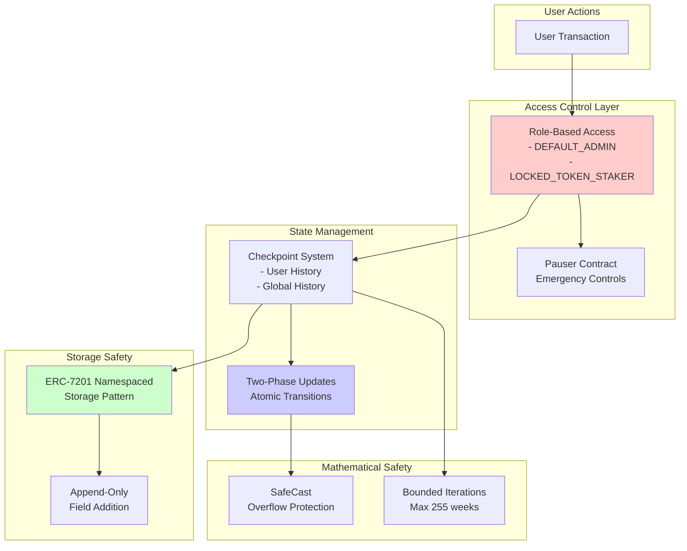

# Security Considerations & Upgrade Safety

## Executive Summary

This document details the security measures, upgrade constraints, and safety mechanisms implemented throughout the evolution of WalletConnect's staking system. It explains how "open heart surgery" was performed on a live production system managing user funds.

## Security Architecture Overview



---

## Part 1: Storage Layout Preservation

### 1.1 The Upgrade Challenge

**Critical Constraint**: Proxy upgrades must NEVER corrupt existing storage.

### 1.2 ERC-7201 Namespaced Storage Pattern

**Implementation (StakeWeight.sol:64-65, 107-112)**:
```solidity
// Namespace prevents storage collisions
bytes32 constant STAKE_WEIGHT_STORAGE_POSITION =
    keccak256("com.walletconnect.stakeweight.storage");

function _getStakeWeightStorage() internal pure returns (StakeWeightStorage storage s) {
    bytes32 position = STAKE_WEIGHT_STORAGE_POSITION;
    assembly {
        s.slot := position
    }
}
```

**Security Benefits**:
- Deterministic storage location
- No collision with inherited contracts
- Safe for diamond pattern extensions

### 1.3 Storage Evolution Rules

**NEVER DO (Would Corrupt State)**:
```solidity
struct BAD_Storage {
    uint256 newField;        // DON'T insert before existing
    WalletConnectConfig config;  // Would shift all slots!
}
```

**ALWAYS DO (Safe Append)**:
```solidity
struct GOOD_Storage {
    // Lines 88-104: Existing fields unchanged
    WalletConnectConfig config;  // slot n
    uint256 supply;              // slot n+1
    // ... other existing fields

    // Line 106+: New fields only at end
    mapping(address => bool) isPermanent;  // slot n+k
}
```

**Verification Process**:
```bash
# Before upgrade
forge inspect OldStakeWeight storage-layout > before.json

# After upgrade
forge inspect StakeWeight storage-layout > after.json

# Verify no existing slots changed
diff before.json after.json
```

---

## Part 2: Stack Depth Management

### 2.1 The "Stack Too Deep" Problem

Without `--via-ir` optimizer, Solidity limits stack to 16 variables.

**Why Not Use --via-ir?**
1. **Deployment Cost**: 2-3x more expensive
2. **Verification Issues**: Etherscan struggles with IR bytecode
3. **Audit Complexity**: Harder to verify optimizations
4. **Production Risk**: Less battle-tested path

### 2.2 Solutions Implemented

**Strategy 1: Storage Pointers**
```solidity
// Bad: Multiple storage reads
function bad() {
    uint256 a = storage.field1;
    uint256 b = storage.field2;
    uint256 c = storage.field3;
    // Stack depth error
}

// Good: Single pointer
function good() {
    StakeWeightStorage storage s = _getStakeWeightStorage();
    // Use s.field1, s.field2, s.field3
}
```

**Strategy 2: Function Decomposition**
```solidity
// Split complex operations
function _checkpoint() {
    _updateUserHistory();  // Separate function
    _updateGlobalState();  // Reduces local variables
}
```

**Strategy 3: Scope Management**
```solidity
{
    // Scope block for temporary calculations
    uint256 tempCalc = complexMath();
    result = tempCalc;
}  // tempCalc freed from stack
```

---

## Part 3: Checkpoint Loop Limits

### 3.1 Maximum Iterations

**Critical Limits (CLAUDE.md)**:
- StakeWeight: Max 255 iterations (~5 years)
- StakingRewardDistributor: Max 52 iterations (~1 year)

**Implementation (StakeWeight.sol:477)**:
```solidity
for (uint256 i = 0; i < 255; i++) {
    // Process maximum 255 weeks
    // Prevents DoS via extreme time gaps
}
```

### 3.2 Gas Optimization vs Safety

**Trade-off Decision**:
```solidity
// Could iterate more, but chose safety
uint256 constant MAX_ITERATIONS = 255;  // ~5 years
// Not: type(uint256).max (would allow DoS)
```

**Known Limitation**:
- System breaks if gap > 255 weeks
- Accepted risk: Requires 5 years of inactivity
- Mitigation: Regular automated checkpoints

---

## Part 4: Reward Distribution Security

### 4.1 No Double Claims

**Protection (StakingRewardDistributor.sol:296, 416)**:
```solidity
weekCursorOf[user] = userWeekCursor;  // Update cursor
userEpochOf[user] = userEpoch;        // Track progress

// User cannot claim same week twice
if (userWeekCursor >= maxClaimTimestamp) {
    return 0;  // Nothing to claim
}
```

### 4.2 Reward Conservation

**Invariant Enforcement**:
```solidity
// Distribution bounded by actual balance
uint256 toDistribute = rewardTokenBalance - lastTokenBalance;
// Never distribute more than received
```

### 4.3 Mid-Week Conversion Safety

**Problem**: User converts decaying → permanent mid-week

**Solution (StakingRewardDistributor.sol:281-296)**:
```solidity
function _calculateTotalSupplyAt(uint256 timestamp) internal view {
    // Recalculate supply on-the-fly
    // Ensures correct proportions even after conversion
    uint256 decaying = calculateDecaying(timestamp);
    uint256 permanent = stakeWeight.permanentSupplyByEpoch(epoch);
    return decaying + permanent;
}
```

---

## Part 5: Permanent Staking Security

### 5.1 Two-Phase Checkpoint Rationale

**Why Not Single Operation?**
```solidity
// UNSAFE: Could leave inconsistent state
lock.end = 0;  // Mark permanent
// What if checkpoint fails here?
```

**Safe Approach (StakeWeight.sol:883-898)**:
```solidity
// Phase 1: Complete removal (safe state)
_checkpoint(user, lock, zeroLock);

// Phase 2: Complete addition (safe state)
_checkpoint(user, zeroLock, permanentLock);

// Both phases atomic within transaction
```

### 5.2 Duration Validation

**Discrete Set Enforcement (StakeWeight.sol:871-874)**:
```solidity
if (durationWeeks != 4 && durationWeeks != 8 &&
    durationWeeks != 12 && durationWeeks != 26 &&
    durationWeeks != 52 && durationWeeks != 78 &&
    durationWeeks != 104) {
    revert InvalidDuration(duration);
}
```

**Security Rationale**:
- Prevents gaming via micro-durations
- Simplifies testing surface
- Clear user expectations

### 5.3 Unlock Safety

**Permanent → Decaying Transition (StakeWeight.sol:924-961)**:
```solidity
function triggerUnlock() {
    // Cannot withdraw immediately
    uint256 newEnd = block.timestamp + baseWeeks * 1 weeks;

    // Full checkpoint maintains consistency
    _checkpoint(msg.sender, prev, next);

    // Clear all permanent state atomically
    s.isPermanent[msg.sender] = false;
    s.permanentStakeWeight[msg.sender] = 0;
}
```

---

## Part 6: Access Control & Admin Powers

### 6.1 Role-Based Security

**Roles Defined**:
```solidity
DEFAULT_ADMIN_ROLE        // Can set maxLock, force withdraw
LOCKED_TOKEN_STAKER_ROLE   // Can create locks for vesting contracts
```

### 6.2 Admin Limitations

**What Admin CANNOT Do**:
- Steal user funds (except via forceWithdraw with transfer)
- Change existing lock terms
- Modify checkpoint history
- Alter reward calculations

**What Admin CAN Do**:
```solidity
// Emergency withdraw for stuck funds
function forceWithdrawAll(address to) external onlyRole(DEFAULT_ADMIN_ROLE) {
    // Transfers actual deposited amount only
    // Clears user position completely
}
```

### 6.3 Emergency Procedures

**Kill Switch (StakingRewardDistributor.sol:539-545)**:
```solidity
function kill() external onlyOwner nonReentrant {
    isKilled = true;
    // Send remaining tokens to emergency address
    rewardToken.safeTransfer(emergencyReturn, balance);
}
```

---

## Part 7: Mathematical Safety

### 7.1 Overflow Protection

**SafeCast Usage**:
```solidity
// Prevent silent overflows
int128 bias = SafeCast.toInt128(int256(value));
// Reverts if value > type(int128).max
```

### 7.2 Underflow Prevention

**Explicit Checks (StakeWeight.sol:296-300)**:
```solidity
if (userPoint.bias < 0) {
    return 0;  // Never return negative
}
```

### 7.3 Division by Zero

**Protected Operations**:
```solidity
if (totalSupply > 0) {
    reward = (balance * tokensPerWeek) / totalSupply;
}
// Skips if no supply
```

### 7.4 Rounding Direction

**Always Round Against User**:
```solidity
// Floor division for rewards
userReward = (userWeight * totalRewards) / totalWeight;
// User never gets more than entitled
```

---

## Part 8: Upgrade Safety Checklist

### 8.1 Pre-Upgrade Verification

- [ ] Storage layout comparison
- [ ] Test on fork with real data
- [ ] Verify proxy upgrade simulation
- [ ] Check gas consumption < block limit
- [ ] Audit new code paths

### 8.2 Upgrade Transaction

```solidity
// Atomic upgrade pattern
1. Pause system (if possible)
2. Upgrade implementation
3. Run post-upgrade verification
4. Unpause system
```

### 8.3 Post-Upgrade Monitoring

- [ ] Verify storage integrity
- [ ] Check user can claim rewards
- [ ] Confirm conversions work
- [ ] Monitor gas usage
- [ ] Watch for reverts

---

## Part 9: Known Limitations & Accepted Risks

### 9.1 Time-Based Limitations

**255 Week Gap**:
- Risk: System breaks if no checkpoint for 5 years
- Likelihood: Extremely low
- Mitigation: Automated weekly checkpoints

**52 Week Claim Window**:
- Risk: Very old rewards become unclaimable
- Likelihood: Low (users incentivized to claim)
- Mitigation: UI reminders

### 9.2 Precision Loss

**Integer Division**:
```solidity
// Small precision loss possible
reward = (999 * 1000) / 3000;  // = 333, not 333.333...
```
- Impact: Dust amounts
- Mitigation: Use high precision (1e18)

### 9.3 Block Timestamp Manipulation

**Minor Miner Influence**:
- Miners can adjust timestamp ±15 seconds
- Impact: Negligible for week-long periods
- Mitigation: Week alignment reduces precision needed

---

## Part 10: Incident Response Plan

### 10.1 Critical Bug Discovery

1. **Immediate**: Pause via Pauser contract
2. **Assess**: Determine funds at risk
3. **Communicate**: Notify users
4. **Fix**: Deploy patched version
5. **Recover**: Use admin functions if needed

### 10.2 Upgrade Failure

1. **Rollback**: Proxy can point to old implementation
2. **Diagnose**: Identify storage corruption
3. **Repair**: May need state surgery contract
4. **Test**: Extensive testing before retry

### 10.3 Economic Attack

1. **Monitor**: Watch for unusual staking patterns
2. **Analyze**: Calculate attacker profit potential
3. **Respond**: Adjust parameters if needed
4. **Prevent**: Add additional checks

---

## Conclusion

The security architecture reflects the reality of performing "open heart surgery" on a live system:

1. **Storage Safety**: ERC-7201 pattern prevents corruption
2. **Stack Management**: Careful optimization without --via-ir
3. **Loop Limits**: Bounded iterations prevent DoS
4. **Mathematical Safety**: Overflow/underflow protection
5. **Upgrade Path**: Clear procedures and rollback capability
6. **Admin Powers**: Limited and auditable
7. **Known Risks**: Documented and accepted

Each security measure represents a careful balance between:
- Gas efficiency vs Safety
- Flexibility vs Predictability
- Innovation vs Stability

The system prioritizes user fund safety above all else, with multiple layers of protection and clear incident response procedures.