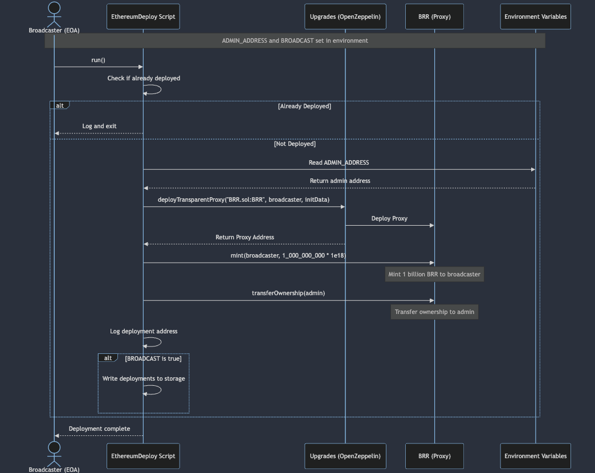
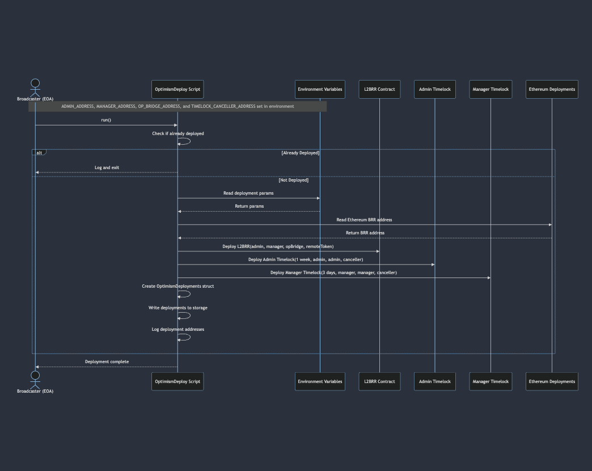
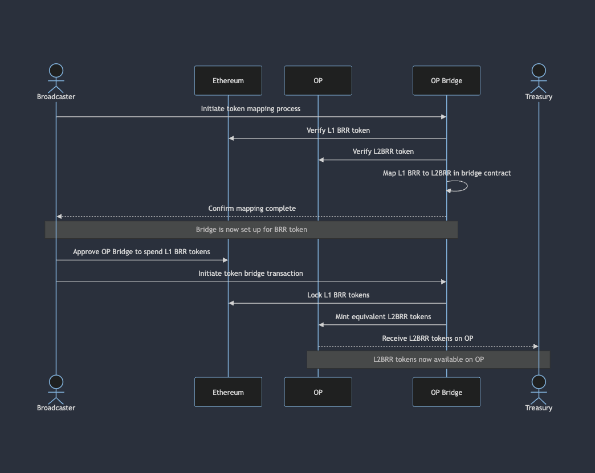
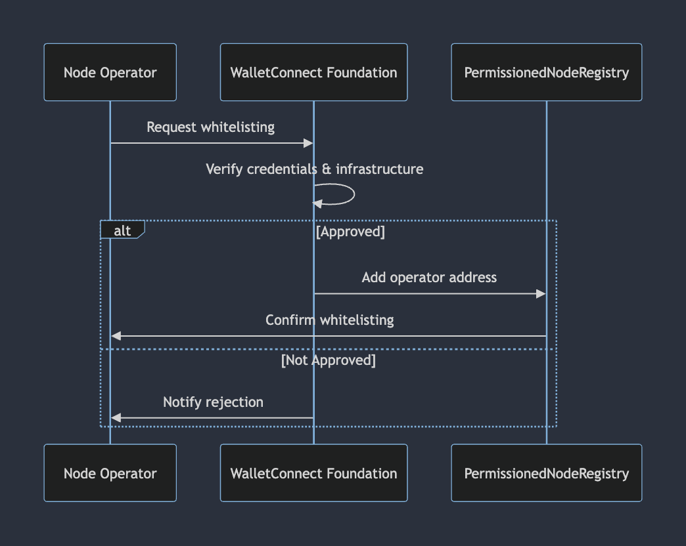
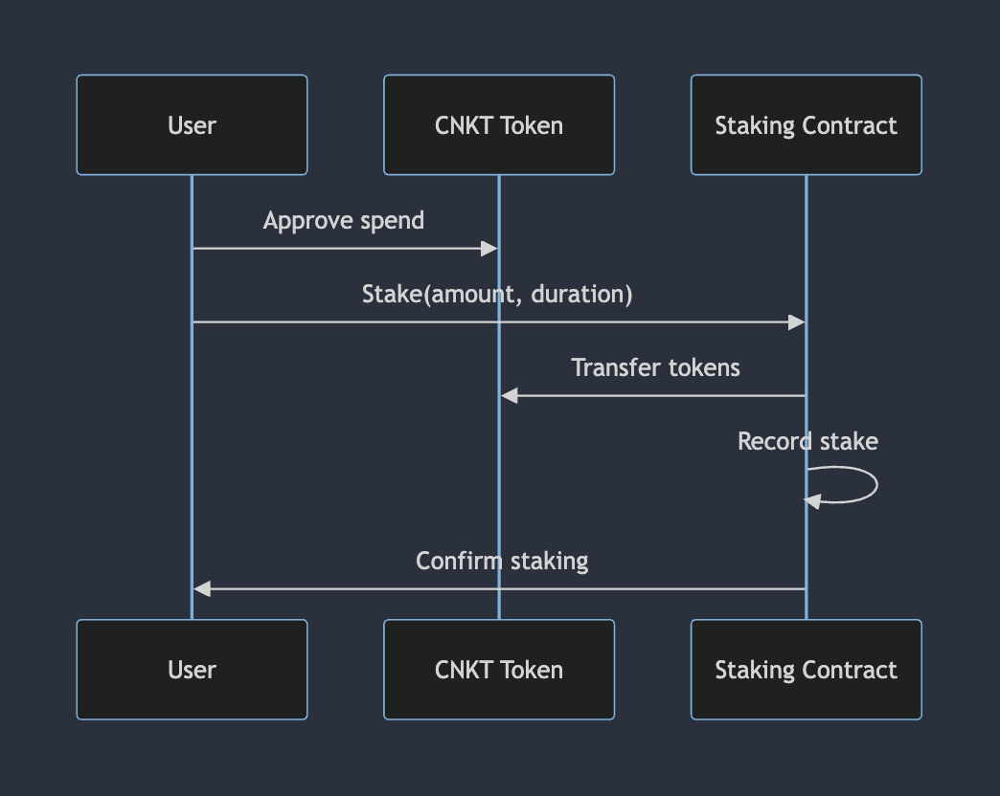
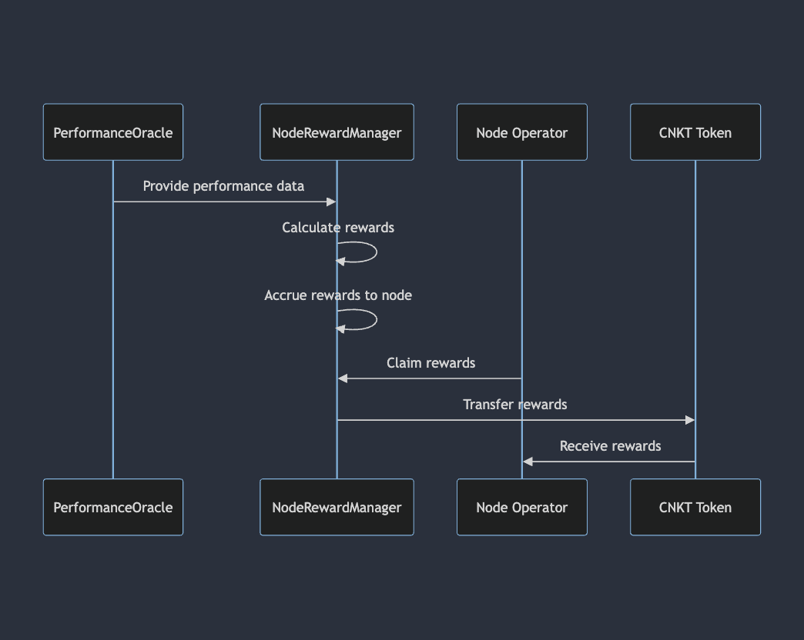

# WalletConnect Decentralization Architecture - Audit Document

## 1. Executive Summary

WalletConnect is developing a decentralized infrastructure to enable permissionless, interoperable messaging between
dApps and wallets. This document outlines the high-level architecture, focusing on the integration of on-chain and
off-chain components, with particular emphasis on the storage layer decentralization.

Key components:

- WCT token for incentivizing node operators and wallets
- Permissioned node operator network (transitioning to permissionless)
- Performance-based rewards system
- Oracle network for reporting node performance

The project aims to decentralize iteratively, starting with the storage layer. The system will initially operate in a
permissioned pre-production environment with 5 external parties, gradually moving towards a fully permissionless
implementation.

## 2. System Architecture

### 2.1 On-chain Components

1. WCT Token (L1 and L2)
   - Common (both have it)
     - ERC20Votes
     - Ownable
     - ERC20Permit
2. WCT (L1)
   - Upgradeable design using OpenZeppelin's upgradeable contracts (TransparentUpgradeableProxy)
   - Ownership controlled by a 5/7 multisig on Mainnet
3. L2WCT
   - Extended functionality for L2 compatibility
   - Transfer restrictions (can be disabled by owner)
   - Minting and burning controlled by the L2 bridge
   - Whitelisting for specific addresses (e.g., treasury, node reward distribution)
4. Timelock
   - Extends OpenZeppelin's TimelockController
   - Minimum delay of 3 days for all operations
   - Custom roles: proposers, executors, and a canceller
5. Staking
   - Fixed-term staking pool for all participants (node operators, wallets, and general users)
   - Minimum stake requirement for node participation in the network
   - Implements time-lock durations from 1 to 104 weeks (equivalent to 1-24 months), which can be extended up to 48
     months in weeks by the manager.
   - Calculates stake weights based on amount and lock duration
6. PermissionedNodeRegistry and WalletRegistry
   - Registries stores whitelist of eligible actors for performance rewards
   - Implements add/remove functions for managing whitelisted addresses
   - Includes query functions for checking eligibility and status
   - WalletRegistry includes certification status for wallets
   - PermissionedNodeRegistry allows nodes to specify a different address for claiming rewards
7. NodeRewardManager
   - Handles reward logic and distribution for node operators
   - Sets maximum emissions per epoch
   - Manages claiming of rewards
   - Implements performance-based reward calculation
   - Interacts with Oracle for performance data
8. WalletRewardManager
   - Manages rewards for certified and whitelisted wallets
   - Synthetix-inspired approach without epochs
   - Implements continuous reward accrual based on wallet status and stake
9. Oracle
   - Interacts with RewardManager to post performance data
   - Includes data validation and safeguards against malfunction or exploitation
10. WalletConnectConfig
    - Service-locator pattern for contract addresses
    - Stores global configuration values
    - Allows for easy updates of contract addresses and parameters
11. Pauser
    - Manages paused states of other contracts
    - Allows for quick response to vulnerabilities or anomalies
    - Implements role-based access for pausing and unpausing

### Proxies

The following contracts will use the OpenZeppelin Upgradeable Contracts library with TransparentUpgradeableProxy:

- Staking
- RewardManagers
- Oracle
- WalletConnectConfig
- WCT Token

Rationale: These core contracts may need updates or bug fixes in the future. Using proxies maintains contract addresses,
ensuring continuity for users and integrations.

### 2.2 Off-chain Components

1. Node Operators
   - Run the distributed database nodes
   - Ensure high availability, low latency, and successful requests
2. Oracle Network
   - Monitors and reports node performance
   - Posts performance data on-chain
3. WalletConnect Foundation
   - Initial governance and administration
   - Manages contract deployments, upgrades, and configurations

### 2.3 Actors and Responsibilities

- WalletConnect Foundation Admin (5/7 MultiSig)
  - Initial setup and governance
  - Contract upgrades
  - Token distribution
  - Whitelisting of transfers for the L2WCT token
  - Whitelisting of wallet addresses
- WalletConnect Foundation Manager (3/5 MultiSig)
  - Update the Staking max times
  - Whitelist node operators addresses
- Timelock Canceller
  - Veto the transactions posted in the Timelocks to prevent execution
- Admin and Manager Timelock (Smart Contracts)
  - Minimum Delay
    - Admin: 1 Week
    - Manager: 3 days
  - Proposer and executor: respective multiSig
- Pauser (2/5 MultiSig)
  - Can pause staking / rewardManager in a single tx
  - Has 1/2 pre-signed txs waiting to be executed
- Emergency MultiSig (5/7)
  - Ready to send address in case of an emergency
- Oracle Daemon
  - Performance tracking of whitelisted nodes
  - On-chain reporting of performance data
- Node Operators
  - Running database nodes
  - Staking WCT tokens
  - Maintaining node performance and availability
- Wallets
  - Implementing WalletConnect standards
  - Staking WCT tokens
  - Optionally running nodes
- Rest of token holders
  - Participation in token distribution events
  - Staking WCT tokens

## 3. Oracle Architecture (DRAFT)

The WCT Oracle system synchronizes on-chain and off-chain states, particularly for node operator performance. It's
inspired by Lido's approach but tailored to WCT's specific needs.

<aside>
💡 Initial version is to go with a single oracle and skip HashConsensus. Currently, with latency as part of the performance formula, it could be hard to have distributed fallback oracles, though we'll include it in the docs anyways as an option.

</aside>

Components:

- Oracle Smart Contracts:
  - PerformanceOracle: Receives and processes performance reports
  - HashConsensus: Manages oracle member consensus on data hashes
- Off-chain Oracle Daemon:
  - Run by each oracle operator
  - Monitors node performance and network metrics
  - Generates and submits reports to on-chain contracts

Workflow:

1. Data Collection: Oracle daemons gather performance data from node operators
2. Report Generation: Oracles compile standardized reports
3. Consensus Phase: Oracles submit report hashes to HashConsensus contract
4. Report Submission: Full report data submitted to PerformanceOracle contract
5. State Update: Smart contracts process report data and update network parameters

Security Considerations:

- Initial set: One oracle per region, run by WC Foundation
- Redundancy: Multiple oracle reports required for consensus
- Data Validation: On-chain sanity checks and anomaly detection
- Upgradability: Oracle contracts are upgradable with timelock and multi-sig controls

Oracle Operator Requirements:

- Technical: Run an archive node, maintain high uptime and low latency
- Stake: Minimum stake of WCT tokens
- Reputation: Known entity in the blockchain space, pass KYC
- Hardware: Meet minimum requirements (CPU, RAM, storage, bandwidth)
- Monitoring: Implement 24/7 monitoring and alerting systems

## 4. Access Control and Security

### 4.1 Role-Based Access Control (RBAC)

WCT implements RBAC using OpenZeppelin's AccessControl and Ownable contracts. Key roles and their capabilities:

1. WCT Token (L1) - Ownable
   - Owner can mint new tokens
   - Mitigations: Ownership transferred to Admin Timelock
2. WCT Token (L2) - AccessControl
   - MANAGER_ROLE
     - setAllowedFrom:
     - setAllowedTo
   - DEFAULT_ADMIN_ROLE
     - disableTransferRestrictions
3. Staking
   - MANAGER_ROLE: Update parameters
   - Mitigations: Trusted multi-sig, time-delayed parameter changes
4. RewardManager
   - ORACLE_ROLE: Set pending rewards
   - DEFAULT_ADMIN_ROLE: Update parameters, pause/unpause contract
   - Mitigations: ORACLE_ROLE assigned to verified Oracle contract, ADMIN_ROLE actions subject to delays and multi-sig
     approval
5. Oracle
   - ORACLE_OPERATOR_ROLE: Submit performance data
   - DEFAULT_ADMIN_ROLE: Update parameters, manage operators
   - Mitigations: Multiple operators required for consensus, multi-sig admin with time-delayed actions
6. PermissionedNodeRegistry
   - MANAGER_ROLE: can manage whitelist and parameters
   - Mitigations: Multi-sig ownership, logged and monitored actions
7. WalletRegistry - Ownable
   1. Owned by Admin to whitelist wallets to get PerformanceRewards
8. WalletConnectConfig
   - DEFAULT_ADMIN_ROLE: Update contract addresses and global values
   - Mitigations: Time-delayed updates, multi-sig admin
9. Pauser
   - PAUSER_ROLE: Pause contracts (Pauser MultiSig)
   - DEFAULT_ADMIN_ROLE: Unpause, manage other roles
   - Mitigations: Logged actions, multi-sig admin with time-delayed actions

### 4.2 MultiSig Setups

- Use of reputable, audited multi-sig contracts (e.g., Gnosis Safe)
- Implementation of time-locks
- Regular review and update of signer sets

### 4.3 Guardian System

- Ability to pause contracts in case of detected vulnerabilities or anomalies
- Managed by a separate multi-sig for quick response to security incidents

### 4.4 Oracle Private Key Management

- Use of secure key management services (e.g., AWS KMS, Google Cloud KMS)
- Regular key rotation and backup procedures

## 5. Upgradeability and Modularity

- Proxy Patterns: Use of OpenZeppelin's TransparentUpgradeableProxy for core contracts
- Upgrade Strategy: Multi-sig controlled upgrades with time-locks
- Modularity Assessment: Evaluation of contract splitting or merging for improved maintainability

## 6. System Invariants

System invariants are properties that should always hold true for your smart contract system. Based on your test files,
particularly those in the `invariant` folder, we can identify the following invariants:

1. Total supply never exceeds max supply:
   - For both WCT and L2WCT tokens, the total supply should never exceed the maximum supply limit.
2. Balances sum up to total supply:
   - The sum of all account balances should always equal the total supply of tokens.
3. Mints minus burns equal total supply:
   - The difference between total minted tokens and total burned tokens should always equal the current total supply.
4. Transfer restrictions enforced (for L2WCT):
   - When transfer restrictions are enabled, only allowed addresses should be able to send or receive tokens.
5. Allowed from and to consistency (for L2WCT):
   - The `allowedFrom` and `allowedTo` status of addresses should be consistent with the contract's state.

## 7. Testing Approach

Our testing approach employs a comprehensive strategy that includes unit testing, integration testing, fuzz testing, and
invariant testing. We use the Branching Tree Technique (BTT) to structure our tests and ensure thorough coverage of all
possible execution paths.

### 7.1 Unit Testing

We use concrete unit tests to verify individual function behaviors. These tests are organized using the BTT approach, as
evidenced by the `.tree` files in our test structure. For example:

- `unit/concrete/l2wct/transfer/transfer.tree`
- `unit/concrete/staking/update-min-stake-amount/updateMinStakeAmount.tree`

These `.tree` files outline all possible execution paths, considering different contract states and function parameters.

### 7.2 Integration Testing

Integration tests verify the interaction between different components of our system. These tests are located in the
`integration/concrete` directory and also follow the BTT structure. For instance:

- `integration/concrete/staking/stake/stake.tree`
- `integration/concrete/timelock/execute/execute.tree`

### 7.3 Fuzz Testing

Fuzz tests are implemented to discover edge cases and unexpected behaviors by providing random inputs to functions.
These tests are located in the `unit/fuzz` directory. Examples include:

- `unit/fuzz/l2-wct/transfer.t.sol`
- `unit/fuzz/reward-manager/postPerformanceRecords.t.sol`

### 7.4 Invariant Testing

Invariant tests ensure that the system's core properties hold true under various conditions. These tests are located in
the `invariant` directory and use handlers and stores to manage state:

- `invariant/WCT.t.sol`
- `invariant/L2WCT.t.sol`

### 7.5 Branching Tree Technique (BTT)

BTT is used throughout our testing approach to ensure comprehensive coverage. Each `.tree` file represents a structured
approach to testing a specific function, considering all possible execution paths, contract states, and function
parameters.

For example, in `unit/concrete/staking/update-min-stake-amount/updateMinStakeAmount.tree`, we might have:

```
updateMinStakeAmount.t.sol
# when caller is not owner
## it should revert
# when caller is owner
## when new value is the same as the old value
### it should revert
## when new value is different from the old value
### it should set the new value
### it should emit a {MinStakeAmountUpdated} event

```

This structure ensures that we test all relevant scenarios for the `updateMinStakeAmount` function.

By combining these testing methodologies and using BTT, we aim to achieve high test coverage and ensure the reliability
and security of our smart contract system.

## 7. Security Considerations

### 7.1 Threat Model

Currently a separate document

### 7.2 Planned Security Improvements

- Development of a build hash verification system for nodes
- Implementation of a more robust consensus mechanism for oracle data

## 8. Best Practices and Industry Standards

- Utilization of OpenZeppelin contracts for standard functionalities
- Consideration of established DeFi protocols (e.g., Synthetix, Lido) for specific mechanisms
- Adherence to Solidity style guide and best practices
- Comprehensive testing suite including unit tests, integration tests, and fuzz testing

## 9. Open Questions / Concerns

- Should we implement an ERC20 recover for the staking contract for sending the wrong token?

## 10. Next Steps and Timeline

1. Finalize and distribute this architecture document to auditors
2. Schedule initial presentation and Q&A sessions with auditors
3. Incorporate auditor feedback and revise architecture as needed
4. Begin phased implementation of smart contracts and off-chain components
5. Conduct internal testing and prepare for external security audits
6. Launch permissioned pre-production environment
7. Develop and execute plan for transitioning to permissionless network

## Appendix: Flow Diagrams

### EthereumDeploy



[Source](https://mermaid.live/edit#pako:eNp1VF1r2zAU_SsXPbnDHcnb8EPBrfIwWJMQNx0MQ1Hsm0TUljxJ7hpK__uuFGWO2yzg2Oiec-65H_Ybq3SNLGMWf_eoKuRS7IxoSwX0E5XTBmaLHISFW6NFXQnr0EBCZ1dHTCeMk5XshHLACw-cuT0a7FuOXaMPUFRGdu4zeL304HVH6Wq0kCw6VL-w67CR6oL27WoVXNAtWRr9eriAmc0fgwH1Io1WLdLRozBSbBq0pTri59oh6BcMdaXEyCDn99_nTznnq1lBFaiasixyfpcXD2DRgVSAg-RJiOjXNze8yMD0KolueBHP7vZYPYPcgmgMivoAdegG1rGzjYM8RvgoElVIhhJk8EPvgiN8lbGH2Fj0VVzmEc2XtCLlcV0DigDX0eUKXW8UiLqV_r82aO0HufUyi94fjFCW2k09CANISkbT-Gp1k9G9ZClshhVJqWvSceHE1SC4XpIgYbPoHYLOKD42FuKQXzQWdMi3S0Zpp0-TyeR0wReY4vTbmYVh_IF_T3yYwkY2jdQqbJfT53VcSup8I7ZoFn8UGruXXRIa-P8sD5EA-sTwWQLpg76v3Y_82PGwwZ_G4ndnWFBpyU-PQ3ik9dNIcjKoWZ_Y0lstdmcUVHGJ_j2cbSAfrFS67Rp0yFLWommFrOnL8eYZJaOXvsWSZfRYC_NcslK9E070ThcHVbHMu0yZ0f1uz7KtoC1OWd_Vwp2-OfH0_S-nvG4Y)

### OptimismDeploy



[Source](https://mermaid.live/edit#pako:eNp1lE1vozAQhv_KiFMq0cPu3jhUIgE10UKyAtS9RIpcPE2sYJs1prtR1f--AzghX80laHjm9Xy85sMrNUcv8Br806IqMRJsa5hcK6AfK602EK9CYA1MjWa8ZI1FAxOKPQxMzYwVpaiZshDlHbiqrZCikRHWlT5AXhpR21s4Xr50dKzehdFKIoVemBHstcLmlk6-T7Os44eHmVbWUHm3YFgkHRZyKRQUQmKly_0tlg5YyhTbUkNfg3Ex78u0OzTYShi66sqlKgd8qS2Cfsd-VD71FUAYpYvlJoyiLM5zH9JwGT7H2RhY_dpMs0X0HI8hpjgUizROVrOfm1m4nMVJMqZAgxaoIxzHdTyeDn18eoryAEyrJm4tUe5isx2WexBvwCqDjB-A9w0gdyuuaGTuTXTxxqmQDB0QQKK3fYn4T7ipY9Vg1_v9PErrBpGRsjuyXzGNlslmJAl6dJVmaFujbohBq5g7rdMiej9wbrA5lyvmV3J3sV6zd1Lgqh98NWGdbXyQgy180PXUCL5FHwxKWnOh96geroTIcieZS99NvsFfxD0td9B1fyWjm1ZVaK6V0jOla2tOfgBnh-asuNPDl3q9AWi55M_LW9n7Fxpr2uMdusj5bQSl8DPUaqK1ofPu4J03znbsxn28xqj4yZNHN41VQKllXaFFz_ckGskEp8_RR5ex9mjXEtdeQI-cmf3aW6tP4lhrdX5QpRdQA-h7RrfbnRe8MXKk77U1p4bdh8xFP_8DNbiP7A)

### BridgeSetup



[Source](https://mermaid.live/edit#pako:eNqFU01PwzAM_StWzuPAjj0gUeCAND60TZx6Mak3rLVOSNKhCfHfcdpBtzGJntq8Z_u9F_fTWFeTKUyk947E0i3jOmBbCeiDNrkA5QIwQhkc1hZjojCAHkNiyx4lwewyU-7SGwXq2jP4NONPz3-Rp-dygHQA12s6HLzMyDIQxi7sKhmgcnFxdaVVBdwLJ8ZEkNyGBFr0nmUNPjhLMQ5sJSp9dlnACwVe7bLScj4fSo4o05EyPcvoZz6gH1vsmSzw2msH6yQF1T6WaV25KODGyYpD-6vRutY3lOjH1KNTG25LOexJP2hIAziCuA-IlKDzsMq3MWo7CCQ7vPZqfUtjllli9CT1kev4T457L2pEonphJ6dRzpzdnGs5JvnAerW6UbzFhvr7P-XOpjmbZQFzssSq-pACTvplOQ1nOcnNj5g5HdwiN_ja0FBnJqal0CLXutefuUdldDNbqkyhrzWGTWUq-VIedsktdmJNkUJHExNct34zxQqbqF-drzWW_R-xP_36BigwBY4)

### Node Operator Whitelisting



### User Staking

<aside>
💡 Users can be NodeOperators, Wallets or just retail.

</aside>



### **Node Performance Rewards**


